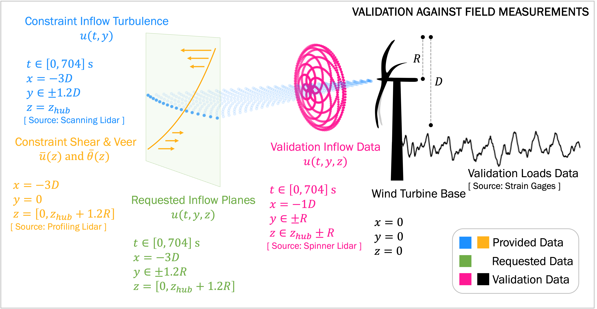
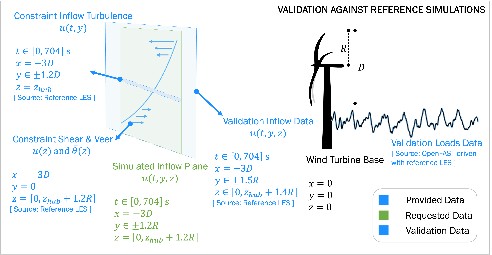

.. _rotor_inflow_benchmark:

Rotor Inflow Benchmarks
=======================

.. toctree::
   :hidden:

   data_description
   unstable
   complex

Current status of this benchmark study: **RELEASED!**   

This benchmark is open to all members of the `IEA Wind Task 57 (JAM) <https://iea-wind.org/task57/>`_. For questions, contact Paula.Doubrawa@nrel.gov

Overview
^^^^^^^^

The current validation efforts focus on an :ref:`unstable period <unstable>` measured in the field. Two validation studies are conducted in parallel, with the second one being optional.

Validation against Field Measurements
*************************************

Models extrapolate above and below the constraint. The flow fields are validated against spinner lidar measurements and used to drive loads simulations. Simulated loads are validated against field measurements.

Validation against Reference Simulations
****************************************

If you would like to see how your model compares to a reference dataset, we recommend performing this optional parallel validation study.

In this study, models extrapolate above and below the constraint. The flow fields are validated against reference simulation flow data and used to drive loads simulations. Simulated loads are validated against the loads produced when simulations are driven with the reference flow data. This parallel validation study **complements the validation against field measurements** by circumventing measurement uncertainties and instead validating against ground truth from a reference large-eddy simulation (LES).

Why?
^^^^

There exist many different methods for simulating turbulent inflows to aeroelastic wind turbine simulations.
The various methods have never been compared side by side and validated against experimental data.
Understanding their strengths and weaknesses will inform us on potential model adoption or model development needs.

How?
^^^^
- Use multiple methods to generate constrained rotor inflows
- Compare them to one another
- **Validate simulated flow fields against measurements** (and reference simulation flow fields)
- Perform aeroelastic simulations that are identical except for the inflow used
- Quantify the effect of inflow accuracy on simulated structural loads
- **Validate simulated structural loads against measurements**

When?
^^^^^

The :ref:`Unstable Benchmarks <unstable>` follow the schedule below:

☑ October 2024: benchmark is released

☐ October - December 2024: modelers simulate inflow planes

☐ December 2024: modelers submit inflow planes to benchmark lead

☐ January 2025: benchmark lead performs inflow analyses

☐ January 2025: modelers perform any requested iterations

☐ February 2025: benchmark lead performs aeroelastic simulations

☐ March 2025: benchmark lead shares final results with modelers

The anticipated final product is a **journal publication** containing model development and adoption recommendations.