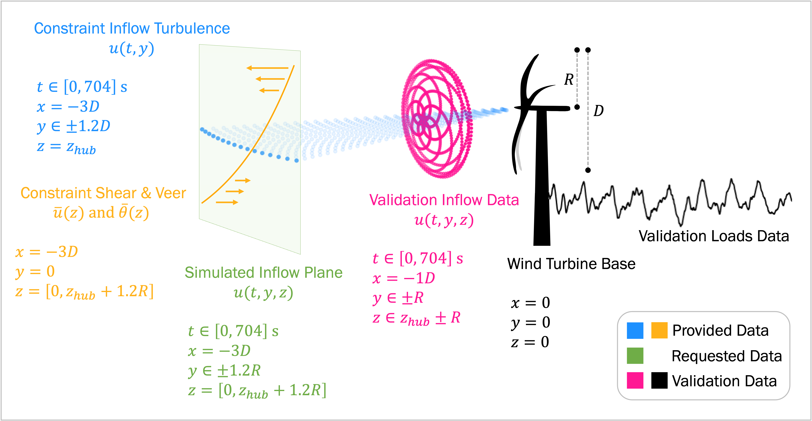

.. _rotor_inflow_benchmark:

Rotor Inflow Benchmarks
=======================

.. toctree::
   :hidden:

   data_description
   unstable
   complex

Current status of this benchmark study: **not yet released**   
Questions? jam@nrel.gov

*Figure: Schematic of the data used in this benchmark.*

Why?
^^^^

There exist many different methods for simulating turbulent inflows to aeroelastic wind turbine simulations.
The various methods have never been compared side by side and validated against experimental data.
Understanding their strengths and weaknesses will inform us on potential model adoption or model development needs.

How?
^^^^

- Use multiple methods to generate constrained rotor inflows
- Compare them to one another
- Validate them against measurements
- Perform aeroelastic simulations that are identical except for the inflow used
- Quantify the effect of inflow accuracy on simulated structural loads

When?
^^^^^

The :ref:`unstable benchmarks <unstable>` follow the schedule below:

- October 2024: benchmark is released

- October - December 2024: modelers simulate inflow planes

- December: modelers submit inflow planes to benchmark lead

- January: benchmark lead performs inflow analyses and requests necessary iterations from modelers

- February: benchmark lead performs aeroelastic simulations

- March: benchmark lead shares final results with modelers
