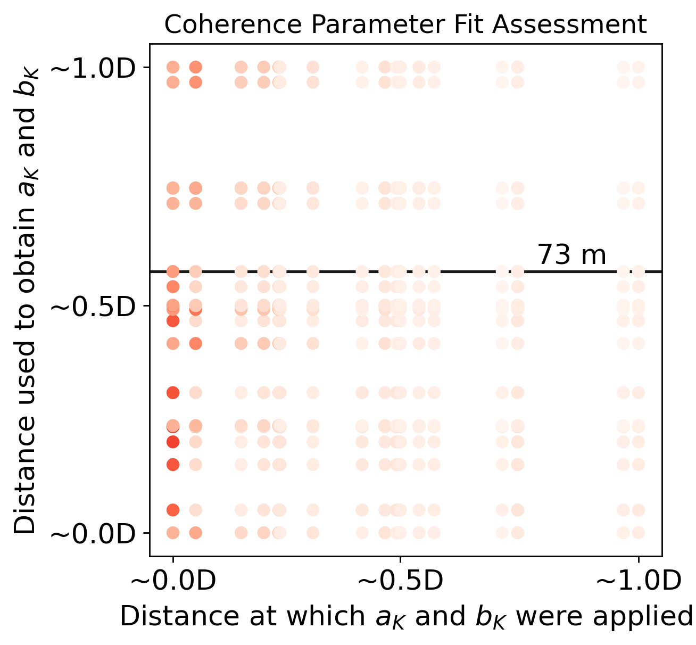
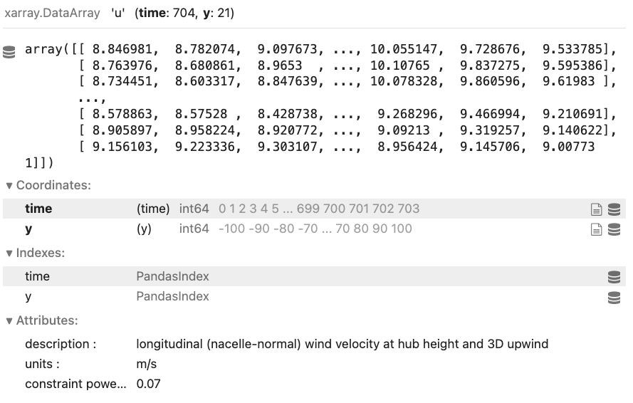
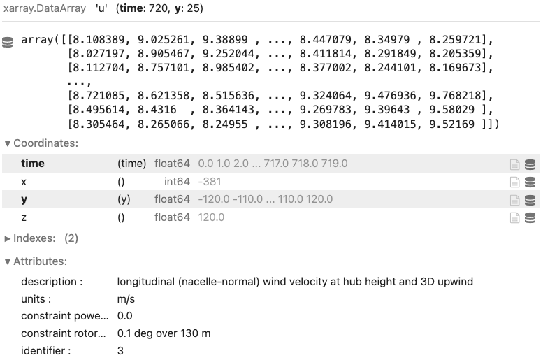
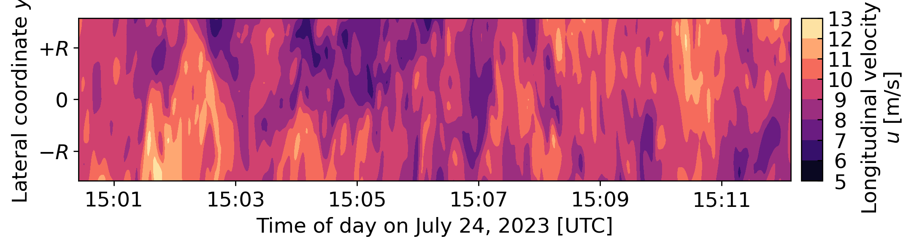
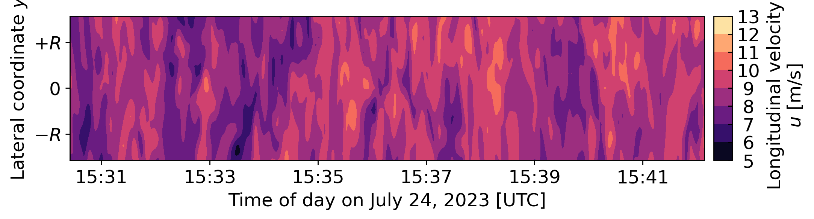
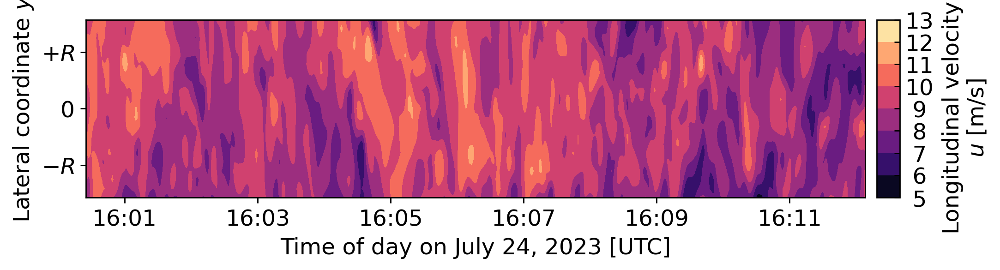
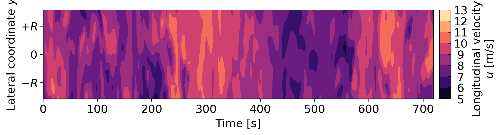
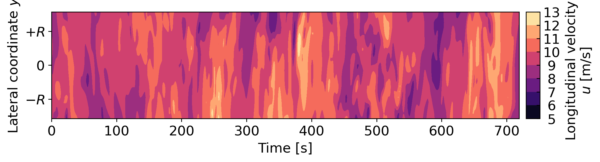

.. _unstable:

Unstable Benchmarks
-------------------

This page gives information specifc to the Unstable Benchmarks. Information that applies to the rotor inflow benchmarks in general is found in :ref:`Data Description <data_description>`.

Modeling Instructions
^^^^^^^^^^^^^^^^^^^^^

Perform steps 1--3 twice: one for the validation against field measurements, and one for the validation against reference simulation data.

1. Download the constraint data for the three cases in :ref:`Data Access <data_access>`

2. Generate :math:`\geq 6` inflows for each case

  - Details on the requested data (what to submit) apply to all benchmarks (not just the unstable one described here) and are found in :ref:`Data Requested <data_requested>`

  - If applicable, use the coherence parameters provided in the table below. Note that they are the same for the three cases.

3. Upload the :math:`\geq 18` inflows 

  - Email alex.rybchuk@nrel.gov to recieve a private Box link

Shear and veer instructions
***************************

  - For the validation against measurements, use the power-law exponent and veer provided in *Table 1* below. The same values are also provided in each ``NL`` netcdf constraint file as an attribute.

  - For the validation against LES, use the power-law exponent and veer provided in *Table 2* below. The same values are also provided in each ``LES`` netcdf constraint file as an attribute.

The Three Measurement Periods
^^^^^^^^^^^^^^^^^^^^^^^^^^^^^

Each benchmark case refers to an individual 704-second period measured in the field. For the unstable benchmark, we will consider three such periods observed within a window of less than two hours. Therefore the three periods are similar in terms of atmospheric conditions, but different enough in terms of dynamics. We consider three periods to add variation and build confidence in the results.

.. table:: *Table 1: Unstable benchmark cases. With the exception of the rows in* **bold**, *the information below is* **not** *meant to be used in the simulations.*

    +---------------------------------------+--------------------------------------------+--------------------------------------------+---------------------------------------------+
    | Case identifier                       | 1500                                       | 1530                                       | 1600                                        |
    +---------------------------------------+--------------------------------------------+--------------------------------------------+---------------------------------------------+
    | Date of period                        | July 24, 2023                              | July 24, 2023                              | July 24, 2023                               |
    +---------------------------------------+--------------------------------------------+--------------------------------------------+---------------------------------------------+
    | Start of period                       | 15:00:25 UTC                               | 15:30:25 UTC                               | 16:00:25 UTC                                |
    +---------------------------------------+--------------------------------------------+--------------------------------------------+---------------------------------------------+
    | End of period                         | 15:12:08 UTC                               | 15:42:08 UTC                               | 16:12:08 UTC                                | 
    +---------------------------------------+--------------------------------------------+--------------------------------------------+---------------------------------------------+
    | Freestream wind speed                 | 9.2 m s :math:`^{-1}`                      | 8.6 m s :math:`^{-1}`                      | 8.9 m s :math:`^{-1}`                       |
    +---------------------------------------+--------------------------------------------+--------------------------------------------+---------------------------------------------+
    | Advection time to turbine             | 41 s                                       | 44 s                                       | 43 s                                        |
    +---------------------------------------+--------------------------------------------+--------------------------------------------+---------------------------------------------+
    | Freestream wind direction             | 226.3 deg                                  | 219.9 deg                                  | 224.0 deg                                   |
    +---------------------------------------+--------------------------------------------+--------------------------------------------+---------------------------------------------+
    | Nacelle heading                       | 224.2 deg                                  | 225.3 deg                                  | 226.7 deg                                   |
    +---------------------------------------+--------------------------------------------+--------------------------------------------+---------------------------------------------+
    | Freestream turbulence intensity       | 11.6%                                      | 11.6%                                      | 11.2%                                       |
    +---------------------------------------+--------------------------------------------+--------------------------------------------+---------------------------------------------+
    | Rotor-layer shear                     | 0.68 m s :math:`^{-1}`                     | -0.21 m s :math:`^{-1}`                    | 0.78 m s :math:`^{-1}`                      |
    +---------------------------------------+--------------------------------------------+--------------------------------------------+---------------------------------------------+
    | **Power law exponent**                | 0.1                                        | 0.01                                       | 0.07                                        |      
    +---------------------------------------+--------------------------------------------+--------------------------------------------+---------------------------------------------+
    | **Rotor-layer veer**                  | -4.4 deg                                   | 1.0 deg                                    | 5.0 deg                                     |
    +---------------------------------------+--------------------------------------------+--------------------------------------------+---------------------------------------------+
    | Near-surface kinematic heat flux      | 0.152 K m s :math:`^{-1}`                  | 0.192 K m s :math:`^{-1}`                  | 0.198 K m s :math:`^{-1}`                   |
    +---------------------------------------+--------------------------------------------+--------------------------------------------+---------------------------------------------+
    | Obukhov length                        | -101.9 m                                   | -82.9 m                                    | -59.6 m                                     |
    +---------------------------------------+--------------------------------------------+--------------------------------------------+---------------------------------------------+
    | Stability parameter                   | -0.02                                      | -0.02                                      | -0.03                                       |
    +---------------------------------------+--------------------------------------------+--------------------------------------------+---------------------------------------------+
    | Hub-height density                    | 1.029 kg m :math:`^{-3}`                   | 1.026 kg m :math:`^{-3}`                   | 1.023 kg m :math:`^{-3}`                    |
    +---------------------------------------+--------------------------------------------+--------------------------------------------+---------------------------------------------+
    | **Coherence decrement parameter**     | 21.64                                      | 21.64                                      | 21.64                                       |
    +---------------------------------------+--------------------------------------------+--------------------------------------------+---------------------------------------------+
    | **Coherence scaling parameter**       | 2.5 :math:`\times 10^{-4}` m :math:`^{-1}` | 2.5 :math:`\times 10^{-4}` m :math:`^{-1}` | 2.5 :math:`\times 10^{-4}` m :math:`^{-1}`  |
    +---------------------------------------+--------------------------------------------+--------------------------------------------+---------------------------------------------+

.. raw:: html

   

       <figure style="flex: 1; margin: 5px;">
           
           <figcaption style="text-align: center;">(a)</figcaption>
       </figure>
       <figure style="flex: 1; margin: 5px;">
           
           <figcaption style="text-align: center;">(b)</figcaption>
       </figure>
       <figure style="flex: 1; margin: 5px;">
           
           <figcaption style="text-align: center;">(c)</figcaption>
       </figure>
   

   <figcaption style="text-align: left; font-style: italic;">Figure: Time-averaged vertical profiles of wind speed as measured by multiple instruments, and best-fit power law using exponents provided above.</figcaption>

Notes on the values provided above:

- The freestream wind speed above is the hub-height, time-averaged, laterally-averaged longitudinal velocity as derived from the nacelle-mounted scanning lidar and therefore corresponds to the single-value average of the ``NL`` dataset provided as a constraint. We use the ``NL`` here to be consistent with the data that is provided as a constraint. Other estimates of the mean freestream wind speed are available from the meteorological tower and ground-based profiling lidar, but those measure a parcel of air that is off to the side for these prevailing wind directions and therefore differ slightly from the lidar-measured values.
- The freestream wind direction above combines the hub-height, time-averaged wind direction measured by the meteorological tower wind vane and the ground-based profiling lidar at the same height. One estimate is available for each instrument, and the average of the two values is provided above. We use the vane and profiling lidar because they are more accurate estimates of wind direction than the nacelle-based scanning lidar.
- The nacelle heading above is a time average considering 704 seconds of SCADA data starting :math:`t_{adv}` s later where  :math:`t_{adv}` is the advection time provided above, computed as :math:`3D/\overline{u}` (with :math:`3D=381` m and :math:`\overline{u}` being the wind speed values provided above).
- The freestrem turbulence intensity above is computed similarly to the wind direction. It combines the hub-height values from the meteorological tower and the ground-based profiling lidar. One estimate is available for each instrument, and the average of the two values is provided above.
- The rotor layer shear above is the difference between the time-averaged wind speeds at the rotor top (184 m) and rotor bottom (56 m) as measured by the ground-based profiling lidar.
- The power law exponent above is the best fit to the time-averaged horizontal wind speeds measured by the ground-based profiling using the hub-height (120 m) value as reference. We use the lidar instead of the meteorological tower sensors for this estimate because it provides a better fit. Fitting to the meteorological tower measurements requires blending multiple sensors, including cups and sonic anemometers, which leads to a poorer fit.
- The rotor layer veer above is the difference between the time-averaged wind directions at the rotor top (184 m) and rotor bottom (56 m) as measured by the ground-based profiling lidar.
- The heat flux above is obtained from the 2.5-meter temperature and vertical velocity ultrasonic measurements, considering a 30-minute window for the Reynolds averaging.
- The Obukhov length above utilizes the value of heat flux provided, friction velocities estimated from the same instrument and using the same methodology as was employed for the heat flux calculation, and the time-averaged,  2-meter air temperature for the reference temperature.
- The stability parameter is simply the inverse of the Obukhov length multiplied by the measurement height of 2.5 m.
- The hub-height density considers dry air and water vapor. It is obtained from vapor pressure and saturation vapor pressure estimates derived from the hub-height air pressure, temperature and relative humidity measurements at the meteorological tower.
- The coherence parameters (:math:`a_K` and :math:`b_K`) were selected according to the procedures described in :ref:`data_description`. The values that provided the lowest errors for most separation distances were those fit to the measured coherence at a separation of 73 m between the wind speed measurements at 110.5 m and 183.5 m.

*Figure: Sum of absolute deviations between the fit and measured magnitude-squared coherence when deriving the coherence parameters for one separation distance and applying it to all others.*

.. figure:: ./images/coh_chosen.png
  :align: center

*Figure: Measured and fit magnitude-squared coherence. The fit uses the* :math:`a_K` *and* :math:`b_K` *parameters provided above, which were obtained by fitting the 73-meter-separation measured coherence function.*

The Three Simulated Periods
^^^^^^^^^^^^^^^^^^^^^^^^^^^

The large-eddy simulations performed for this study match the atmospheric conditions measured in the field. In these simulations, we have less control over the time-averaged vertical profiles. Therefore, they do not match exactly the field measurements. Instead, the shear and veer for each of the three simulated cases is provided below. As for the measurement data, the same values are also provided as attributes in the netcdf constraint files.

.. table:: *Table 2: Shear and veer in the large-eddy simulations of the unstable benchmark cases.*

    +---------------------------------------+--------------------------------------------+--------------------------------------------+---------------------------------------------+
    | Case identifier                       | 1                                          | 2                                          | 3                                           |
    +---------------------------------------+--------------------------------------------+--------------------------------------------+---------------------------------------------+
    | **Power law exponent**                | 0.07                                       | 0.06                                       | 0.00                                        |      
    +---------------------------------------+--------------------------------------------+--------------------------------------------+---------------------------------------------+
    | **Rotor-layer veer**                  | -1.4 deg                                   | 1.4 deg                                    | 0.1 deg                                     |
    +---------------------------------------+--------------------------------------------+--------------------------------------------+---------------------------------------------+

.. _data_access:

Data Access
^^^^^^^^^^^

Find the constraints for each of the periods on `Zenodo <https://zenodo.org/records/13799999>`_. 

- One set of files per case (1500, 1530 and 1600 for the measured flows; 1, 2 and 3 for the simulated flows)

- Each ``NL`` file contains an ``xarray.DataArray`` that looks like:

- Similarly, each ``LES`` file constains an ``xarray.DataArray`` that looks like:

Sneak peek
**********

The data inside each ``NL`` file is shown below for each of the three measurement periods.

*(a) 1500*

*(b) 1530*

*(c) 1600*

The data inside each ``LES`` file is shown below for each of the three simulation periods.

*(a) 1*

.. figure:: ./images/constraint_LES_2.png
  :align: center

*(b) 2*

*(c) 3*

